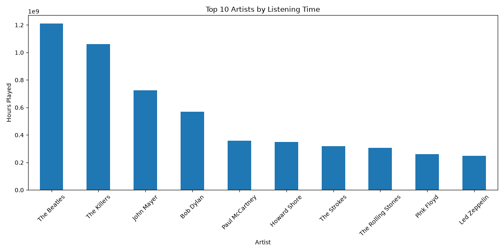
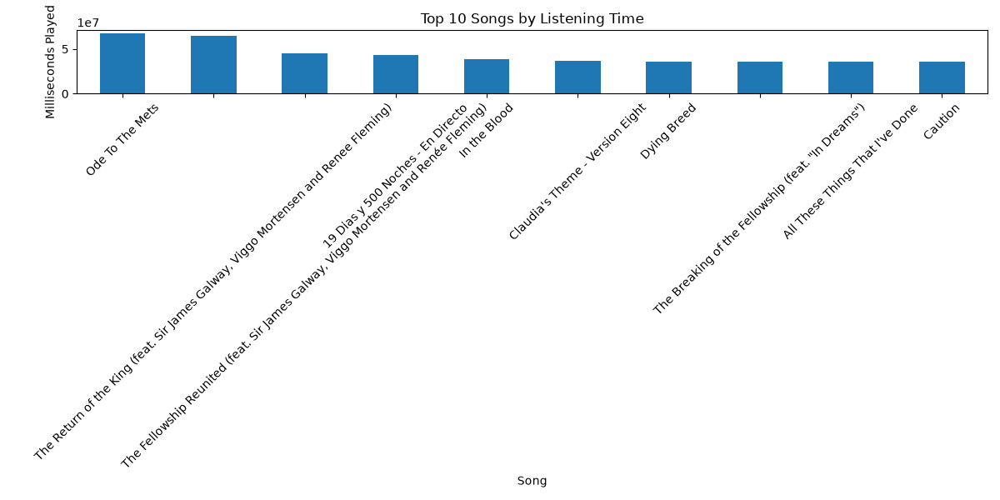
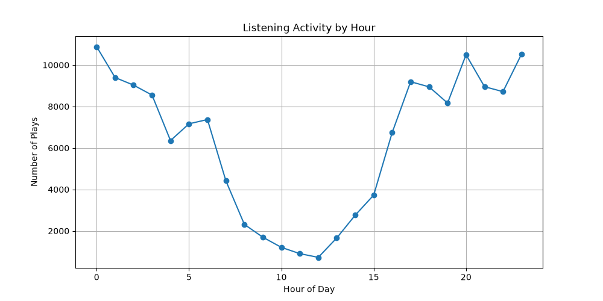
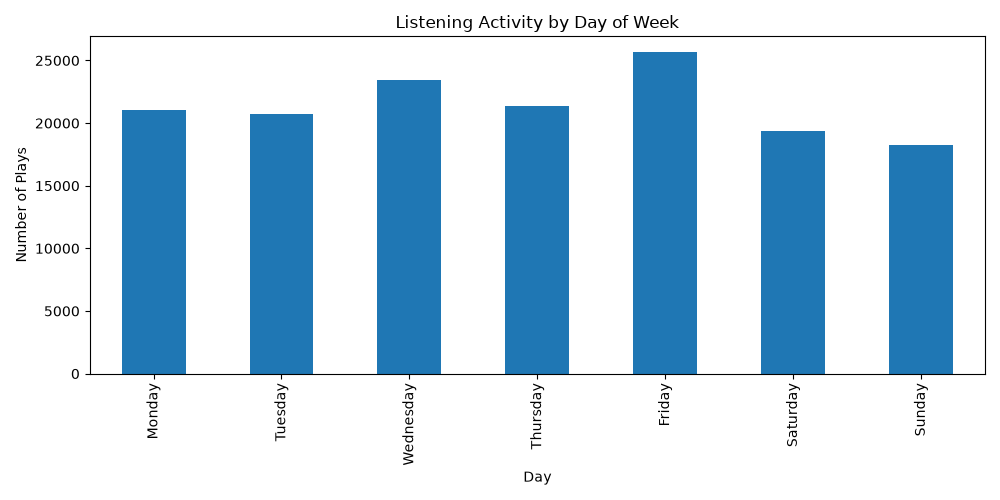
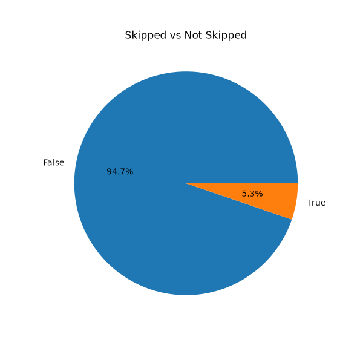

# 🎵 Spotify Listening History Analyzer

A Python data analysis project that explores Spotify listening history using Pandas and Matplotlib to uncover listening trends through data visualization.

---

# 📖 Overview

The Spotify Listening History Analyzer is a beginner-friendly data analysis project that processes Spotify listening history stored in CSV files.

Using **Pandas** for data manipulation and **Matplotlib** for visualization, this project transforms raw listening data into meaningful insights through charts and graphs.

The project demonstrates a complete data analysis workflow:

- Loading datasets
- Exploring and cleaning data
- Performing exploratory data analysis (EDA)
- Creating visualizations
- Generating insights from data

  
## 📑 Table of Contents

- [Features](#-features)
- [Technologies Used](#-technologies-used)
- [Dataset](#-dataset)
- [Installation](#-installation)
- [Project Structure](#-project-structure)
- [Visualizations](#-visualizations)
- [Key Insights](#-key-insights)
- [Why This Project?](#-why-this-project)
- [Skills Demonstrated](#-skills-demonstrated)
- [What I Learned](#-what-i-learned)
- [Future Improvements](#-future-improvements)
- [License](#-license)
---

# ✨ Features

- 🎤 Top Artists Analysis
- 🎵 Top Songs Analysis
- 🕒 Listening Activity by Hour
- 📅 Listening Activity by Day
- ⏭️ Skip Analysis
- 📊 Automatic Chart Generation
- 💾 Save Visualizations as PNG Images

---

# 🛠 Technologies Used

- Python
- Pandas
- Matplotlib

---

# 📂 Dataset

This project uses a publicly available Spotify listening history dataset obtained from Kaggle for educational and data analysis purposes.

The dataset includes information such as:

- Track Name
- Artist Name
- Album Name
- Timestamp
- Playback Duration
- Platform
- Skip Status

Files included in this project:

```text
data/
├── spotify_history.csv
└── spotify_data_dictionary.csv
```

> **Note:** Although this project uses a Spotify dataset from Kaggle, the same workflow can be applied to a personal Spotify listening history export.

---

# 🚀 Installation

Clone the repository:

```bash
git clone https://github.com/ven792/spotify-listening-history-analyzer.git
```

Navigate into the project:

```bash
cd spotify-listening-history-analyzer
```

Install the required libraries:

```bash
pip install -r requirements.txt
```

Run the project:

```bash
python analysis.py
```

---

# 📁 Project Structure

```text
spotify-listening-history-analyzer/
│
├── data/
│   ├── spotify_history.csv
│   └── spotify_data_dictionary.csv
│
├── Images/
│   ├── top_artists.png
│   ├── top_songs.png
│   ├── listening_by_hour.png
│   ├── listening_by_day.png
│   └── skip_analysis.png
│
├── analysis.py
├── requirements.txt
├── README.md
├── LICENSE
└── .gitignore
```

---

# 📊 Visualizations

## 🎤 Top Artists

Displays the artists with the highest number of plays based on the listening history dataset.



## 🎵 Top Songs

Highlights the songs that appear most frequently in the listening history.



## 🕒 Listening Activity by Hour

Shows the hours of the day when listening activity is highest.



## 📅 Listening Activity by Day

Visualizes listening habits across different days of the week.



## ⏭️ Skip Analysis

Compares skipped tracks with tracks that were played completely.



---

# 💡 Key Insights

The generated visualizations reveal several interesting listening patterns:

- A small number of artists account for a significant portion of total listening activity.
- Listening behavior varies depending on the time of day.
- Certain days of the week show higher listening activity than others.
- Skip analysis helps identify playback behavior and engagement trends.

These insights demonstrate how simple exploratory data analysis can transform raw data into meaningful information.

---

# 🎯 Why This Project?

This project was created to practice the complete data analysis workflow using Python.

It demonstrates how raw data can be:

- Loaded and explored
- Cleaned and organized
- Analyzed for trends and patterns
- Visualized using charts and graphs

Although the project uses a Kaggle dataset, the same techniques can be applied to real-world datasets and personal Spotify listening history exports.

---

# 📚 Skills Demonstrated

This project demonstrates practical experience with:

- Python Programming
- Data Analysis
- Exploratory Data Analysis (EDA)
- Data Cleaning
- Pandas DataFrames
- Data Visualization
- Matplotlib
- Working with CSV Files
- Git & GitHub
- Project Documentation

---

# 📖 What I Learned

While building this project, I learned how to:

- Process real-world datasets using Pandas
- Explore and clean structured data
- Create meaningful visualizations with Matplotlib
- Identify trends and patterns through exploratory data analysis
- Organize Python projects using a clear folder structure
- Document projects professionally using Markdown and GitHub

---

# 🚀 Future Improvements

Potential enhancements include:

- Interactive dashboards using Plotly
- Streamlit web application
- Spotify Web API integration
- Genre-based analysis
- Monthly and yearly listening trends
- Additional statistical insights
- Personalized music recommendations

---

# 📄 License

This project is licensed under the MIT License.

---

# ⭐ Acknowledgements

- Spotify listening history dataset sourced from Kaggle for educational purposes.
- Built using Python, Pandas, and Matplotlib.

---

# 👩‍💻 Author

**Venya Mongia**

GitHub: https://github.com/ven792

---

⭐ If you found this project interesting, consider giving it a star!


